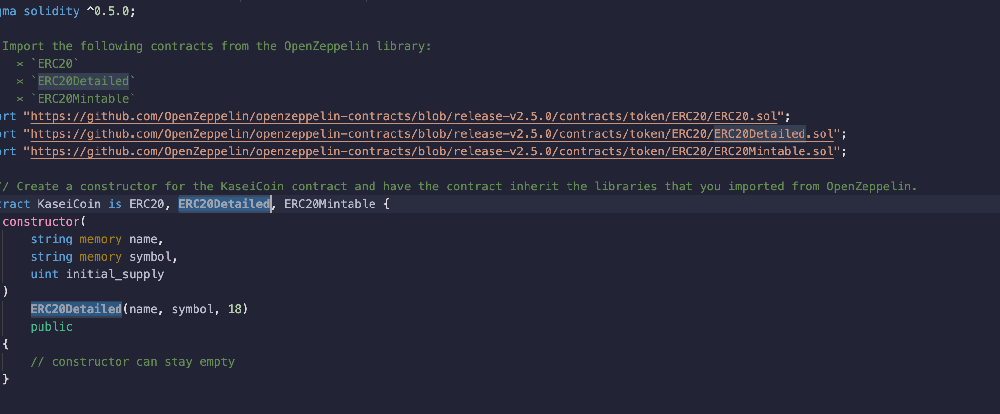
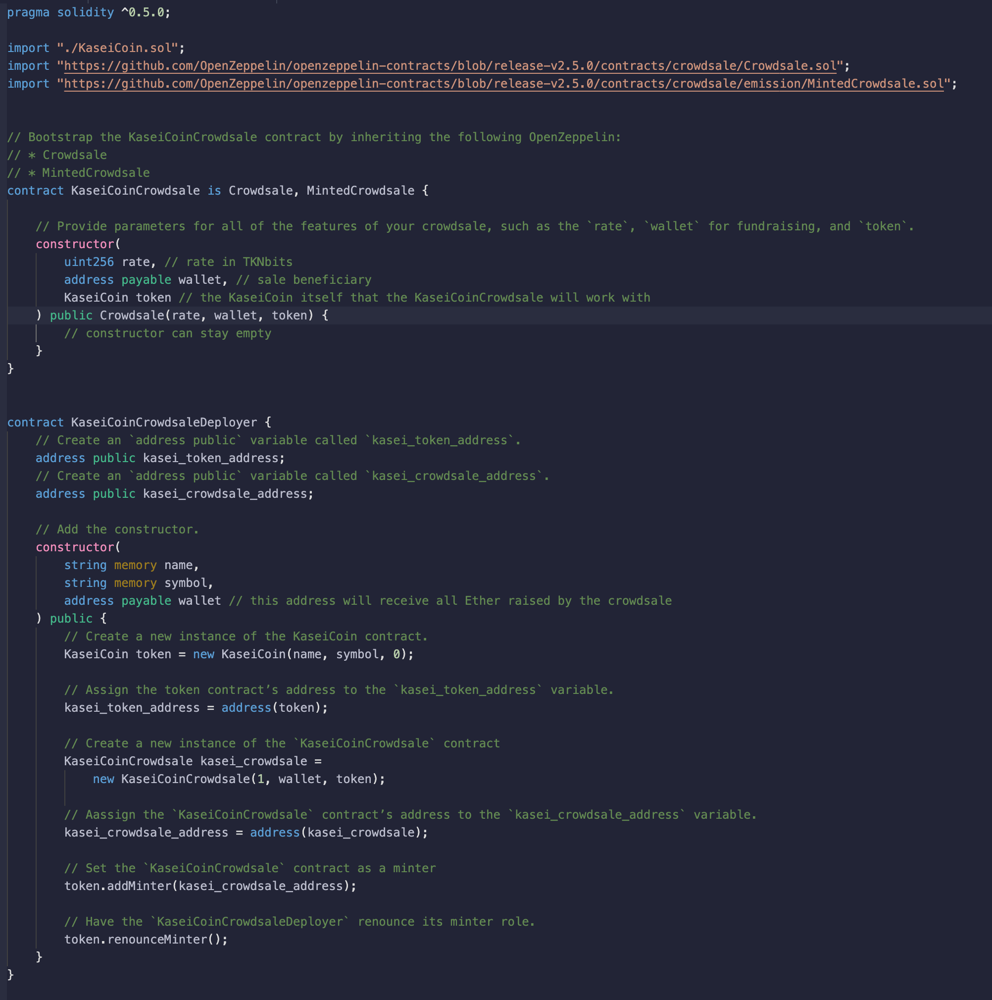
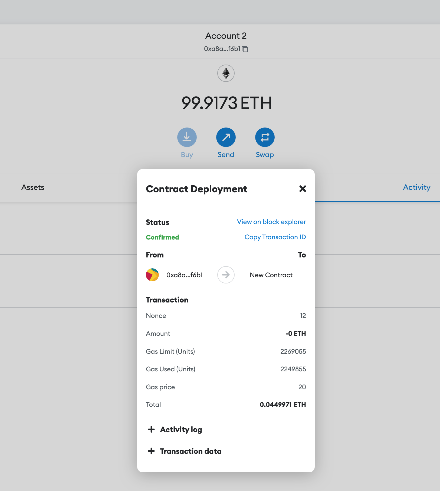
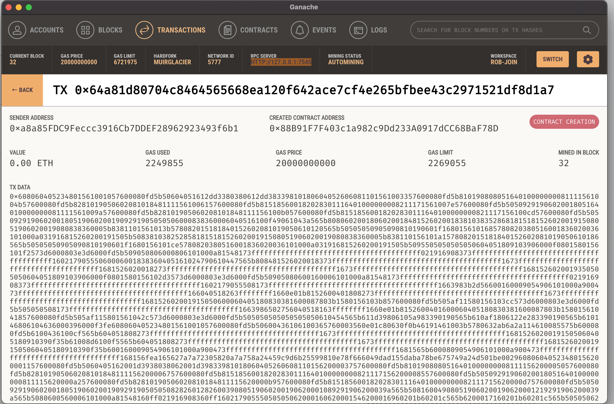

`TOKENOMICS`   *a **monetary system** for the new Mars colony. You have decided to base this new monetary system on `blockchain` technology, and to define a new cryptocurrency called **KaseiCoin**. (“Kasei” means “Mars” in Japanese.)
KaseiCoin will be a fungible token that is **ERC-20** compliant. You will launch a crowdsale that will allow people who are moving to Mars to convert their earthling money to KaseiCoin*.

[CLICK HERE](https://www.coindesk.com/learn/what-is-tokenomics-and-why-is-it-important/) to learn more about TOKENOMICS 🧠

## `KaseiCoin`

# Step 1

Create the KaseiCoin Token Contract which inherits from the ERC20 , ERC20Detailed , ERC20Mintable

[CLICK HERE](https://www.investopedia.com/tech/why-crypto-users-need-know-about-erc20-token-standard/) to learn more abourt ERC20

# STEP 2 

Create the KaseiCoin Deployer Contract
    
> `Kaseicoin` *token cntract has been import to the **deployer** contract*

# STEP 3 

EVALUATION

[CLICK HERE](https://dapp-world.com/blogs/01/how-to-connect-ganache-with-metamask-and-deploy-smart-contracts-on-remix-without-1619847868947) to learn how to test  smart contracts using `Metamask`and `Ganache`  

`MetaMask` Eval

`Ganache` Eval

## REQUIRMENTS

[REMIX IDE](https://remix-project.org)

[METAMASK](https://metamask.io)

[GANACHE](https://trufflesuite.com/ganache/)

## INSTALLATION

[ZIP FILE](https://github.com/brprod8/KAISECOIN.git)

[CLONE REPO](https://github.com/brprod8/KAISECOIN)

## LICENSE

**Open to Experiemnt**

BY:Robert Smith

Credit:UC BERKELEY

Email : Roberts.track@yahoo.com

